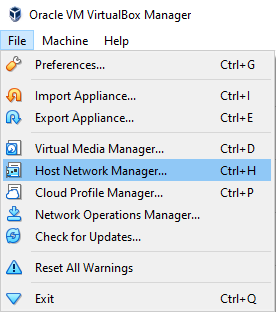
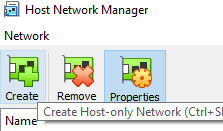
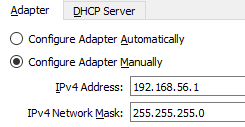
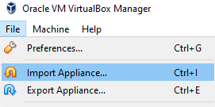
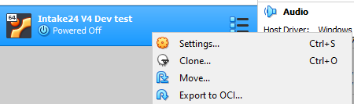
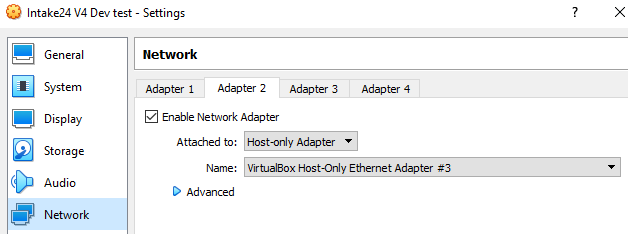

# Development virtual machine

The Intake24 development virtual machine provides pre-installed dependencies such as the PostgreSQL DBMS
and Redis server, a blank system database and a (relatively) recent snapshot of the food database.

This VM is intended to make getting started with Intake24 development easier, however it is not required to
set up a working development environment and all dependencies can be installed manually if preferred.

::: warning
Note that the VM currently does not include the portion size image database. These files will be added later.
:::

## Download

An image of the latest version of the development VM is available for download here:

[https://intake24.s3-eu-west-1.amazonaws.com/vm/Intake24 V4 Dev Build f188a1f84a776326.ova](https://intake24.s3-eu-west-1.amazonaws.com/vm/Intake24+V4+Dev+Build+f188a1f84a776326.ova)

## Prerequisites

The VM image has been produced using [Oracle VirtualBox](https://www.virtualbox.org) v6.0. The VM image format
is OVA 2.0 and can technically be used with most VM software, however it has only been tested using VirtualBox
and we therefore recommend using VirtualBox.

## Installation to VirtualBox

1. In the main menu of VirtualBox open `File > Host Network Manager`.

2. In the Host Network Manager window click `Create`.

3. In the Adapter tab at the bottom of the Host Network Manager window, set IPv4 address to `192.168.56.1` and
   IPv4 network mask to `255.255.255.0`

4. In the DHCP tab, uncheck `Enable DHCP`.

5. In the main menu of VirtualBox click `File > Import Appliance`.

6. Select the VM image file downloaded from the URL above.

7. Change the name of the VM if you like, but keep the rest of the settings as they are.

8. Right-click on the imported VM and select `Settings`

9. Open the `Network` section and make sure that Adapter 1 is set to `NAT` and Adapter 2 is set to `Host-only adapter`
   attached to the Host Only Network you configured in step 2:

10. Resolve any other issues with the VM (e.g. video memory usage)

## System notes

The development VM runs `Ubuntu Server 20.04 LTS`.

### SSH access

The VM is configured with a static IP of `192.168.56.4` accessible via the Host Only Network. You can log into
it from your host machine using SSH as `intake24` using the password `intake24`. This user has `sudo` rights.

### PostgreSQL

#### Access

PostgreSQL is running on the standard port (5432) and is accepting connections from any network. SSL is off.

The Intake24 databases are:

- System database: `intake24_system`, user `intake24`, no password.
- Foods database: `intake24_foods`, user `intake24`, no password.

#### Logs

The PostgreSQL server in the VM is configured to log all queries for debug purposes. The log can be found in:

`/var/lib/postgresql/12/main/pg_log`
