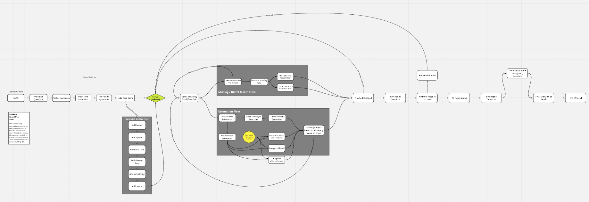

# Survey (Recall)

Built with Vue.js.

## User flow

This is currently hosted on Miro (TF's account), will migrate here if useful: [view interactive user flow](https://miro.com/app/board/o9J_kpEZdcc=/)

## Custom recall flow

There is a number of places in the user flow where custom prompts can be inserted. Custom prompts are added to the _scheme_. They can be inserted at the following points in the user flow:

- Pre-meal
- Post-meal
- Submission (before submission)
- Pre-foods
- Foods (during food selection)
- Post-foods

Further details about the custom recall flow can be see in the [Admin documentation](../admin/#custom-recall-prompts).

### Prompts

These are defined as types, loaded as components (mapped into `Recall.vue`). Rendered using Vue `component`, with a type handed dynamically using :is.

### Source

[Github](https://github.com/intake24/intake24/tree/main/apps/survey)

### Layout

Grid system uses [Vuetify](https://dev.vuetifyjs.com)
