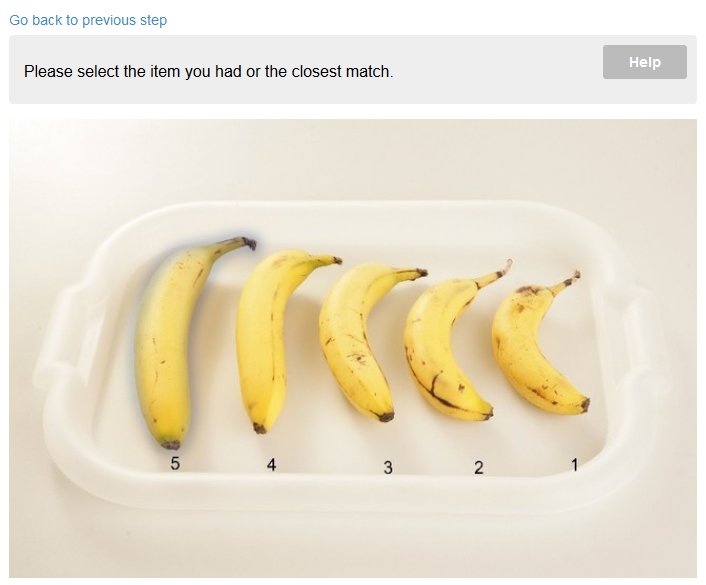
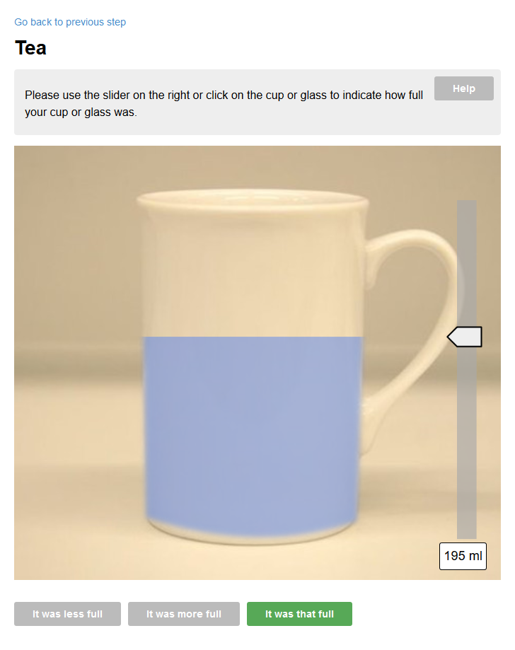
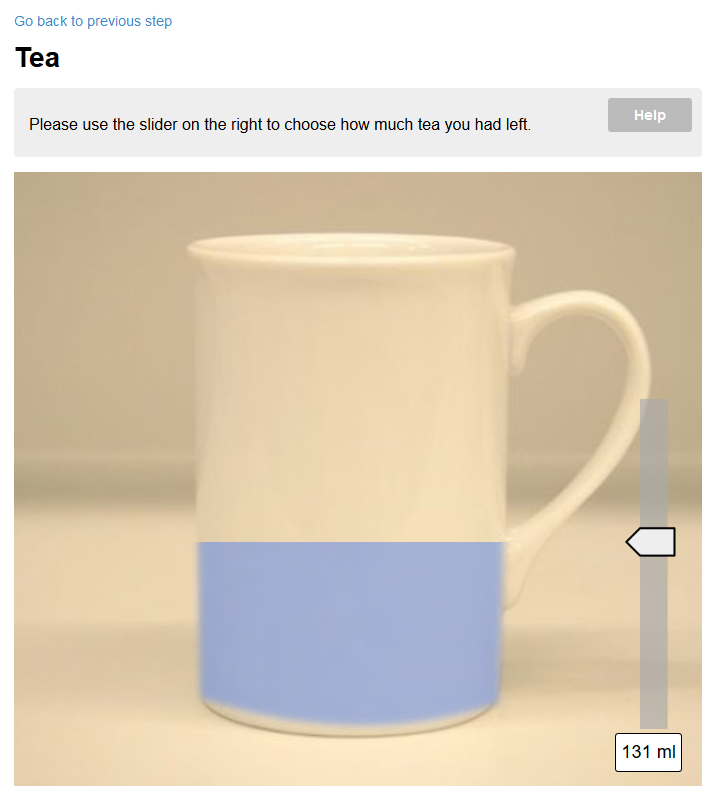
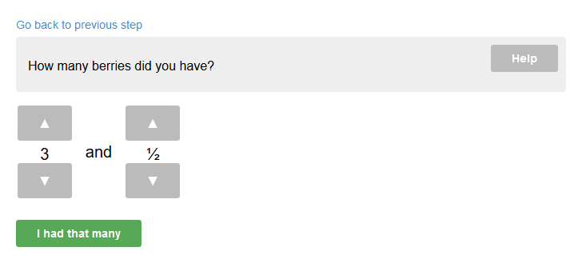
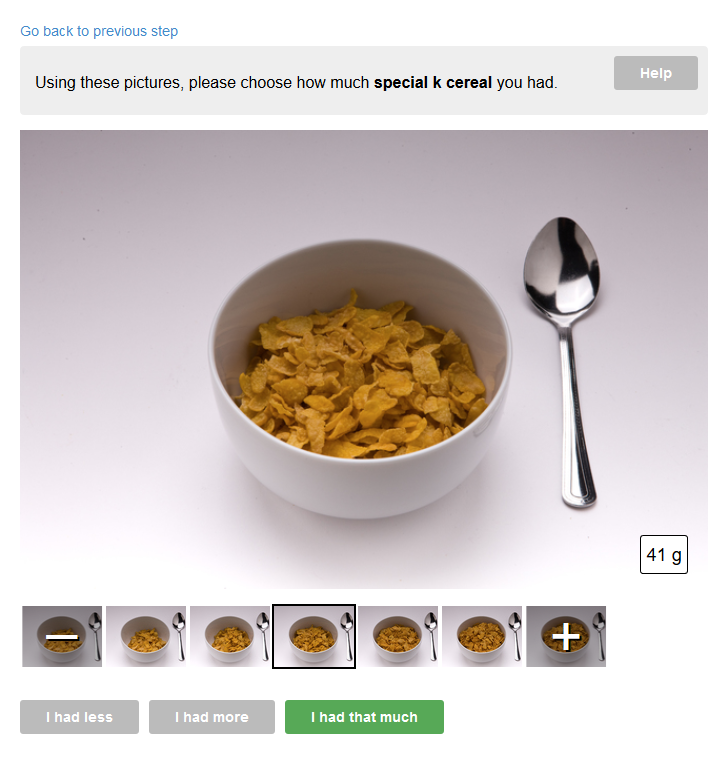
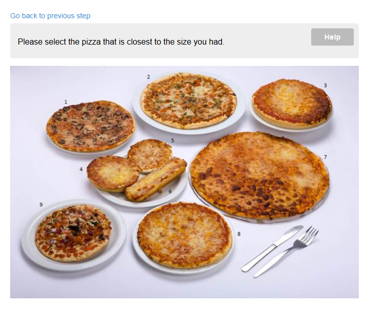
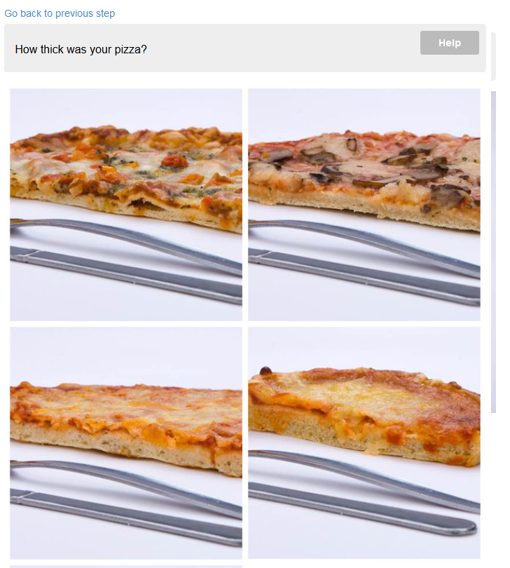
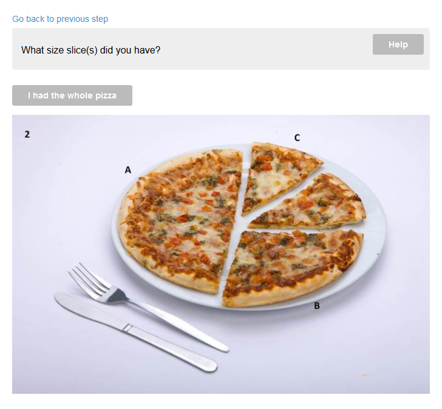
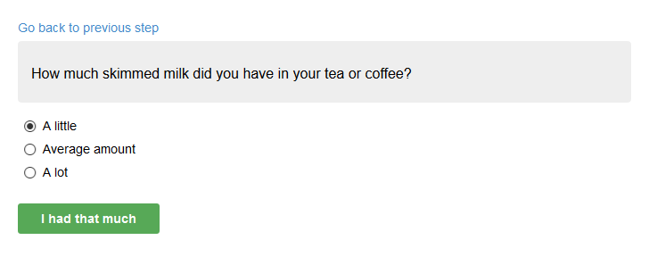

# Portion size methods

This page describes the portion size estimation methods used in Intake24 with respect to user interaction. See [the API
documentation](/open-api.html#tag/portionsize){target="blank"} for the related API functions and data structure description.

## Portion size estimation option selection

This screen is the first step of the portion size estimation process.

If there is more than one way to estimate the portion size defined for the food the system will ask the respondent to
choose the option they would like to use.

Each option has an associated small image and a text description. The description text is localised and displayed
in the respondent's local language. Portion size estimation options don't necessarily have to use different methods
(i.e. they could be several `as served` options using different sets of images).

The number of options that can be associated with a food is technically unlimited, but in practice is typically
between 2 and 5.

If there is only one portion size estimation option associated with a food, this screen is not shown.

See also the [get food data](/open-api.html#tag/food){target="blank"} API function and the
[v3 implementation](https://github.com/MRC-Epid-it24/survey-frontend/blob/master/SurveyClient/src/main/java/uk/ac/ncl/openlab/intake24/client/survey/prompts/ChoosePortionSizeMethodPrompt.java).

## As served

Method id: `as-served`

The "as served" portion size estimation method uses a sequence of images of food served on a plate. The weight of
food shown in each image is carefully measured when the pictures are taken and is stored in the database.

Usually there are seven images covering 95% of the typical portion sizes, however this number is not fixed and some
foods use fewer or more images.

The user is asked to select the image that looks most like the amount of food they were served. The images can be
selected either using the `I had less` and `I had more buttons` or by clicking on a thumbnail.

There are special options to indicate that the amount of food consumed was less than in the smallest or more
than in the larges portion in the available images. These options can be accessed either by clicking the `I had less`
or `I had more` button while having the smallest and the largest potion size image selected respectively or by
clicking on the special `-` or `+` thumbnails.

If this option is selected, the respondent is asked to choose the fraction of the smallest porion or the multiple of
the largest portion. The fraction selection is currently implemented using arrow buttons that allow to adjust the
fraction in 1/4 increments. The resulting portion weight is also displayed for reference.

The "as served" method can optionally include a second set of images representing the leftovers. If leftovers function
is enabled, the respondent is asked to indicate how much food they had left using the same UI and the resulting
portion size is calculated as `(serving weight) - (leftovers weight)`.

### Parameters

- `serving-image-set`: reference to an as served image set used to estimate the size of the portion that was served
  to the respondent.
- `leftovers-image-set`: reference to an as served image sequence used to estimate the amount of food left by the
  respondent.

See also [get as served data](/open-api.html#tag/portionsize/get/portion-sizes/as-served-sets/{id}){target="blank"} API function
and the [v3 implementation](https://github.com/MRC-Epid-it24/survey-frontend/blob/master/SurveyClient/src/main/java/uk/ac/ncl/openlab/intake24/client/survey/prompts/simple/AsServedPrompt2.java)

## Guide image

Method id: `guide-image`

The "guide image" portion size estimation method uses a single image showing several distinct objects. The respondent
is asked to select the object that most closely matches the food they had. This could be used to determine,
for example, the size of a fruit, or the shape and volume of a tin.

Objects can be selected by either clicking/tapping them directly in the image or by using the arrow keys on the keyboard.

Each object in the image is defined in terms of its outline (represented as coordinates of points of a polyline),
description and weight.

In the current implementation each outline is a separate transparent overlay image generated on the server when changes
are made to the list of objects in the guide image. This technique was used for compatibility purposes with older
browsers but it is no longer relevant and should be replaces with a canvas or SVG based approach instead.

Having selected an object the respondent is then asked to enter how many items like that they had.

The quantity input UI currently has two separate counters for whole and fractional parts. This screen has been
identified as one of the more confusing ones and needs a redesign.

### Parameters

`guide-image-id`: reference to a guide image definition

See also [get guide image data](/open-api.html#tag/portionsize/get/portion-sizes/guide-images/{id}){target="blank"} API function
and the [v3 implementation](https://github.com/MRC-Epid-it24/survey-frontend/blob/master/SurveyClient/src/main/java/uk/ac/ncl/openlab/intake24/client/survey/prompts/simple/GuidePrompt.java).

## Drink scale

Method id: `drink-scale`

This portion size estimation method is used for hot and cold drinks served in a glass, cup or mug. In the first step,
the respondent is offered to choose the glass/cup/mug that they would like to use:

The UI element used in this step is called an "image map". It is similar to
[HTML image maps](https://en.wikipedia.org/wiki/Image_map) but uses a custom implementation to avoid compatibility
issues between browsers. An image map is a combination of a base image showing a set of distinct objects that the
user can click/tap individually on to select one. In the image above, mug 2 is selected as shown by the outline.

After the appropriate mug/cup/glass is selected, the system presents a "sliding scale" control based on the selected
item:

The sliding scale consists of a side view of a mug/cup/glass combined with an overlay that represents the fill level.
Respondents can use the slider on the side or simply click/tap on the image to adjust the fill level.

Finally, the respondents are asked to indicate how much of the drink they had left. In this step the scale is limited
to the initial fill level reported in the previous step:

### Parameters

- `drinkware-id`: reference to a drinkware set (see the API method)
- `initial-fill-level`: initial position of the fill level slider (in normalised units, 0.0 to 1.0).
- `skip-fill-level`: if set to true the “how full was your cup/glass” question will be omitted and the
  system will proceed directly to “how much you had left”. This is useful when the initial fill level is
  standard, e.g. for takeaway cups.

See also [get sliding scale data](/open-api.html#tag/portionsize/get/portion-sizes/drinkware-sets/{id}){target="blank"} API function
and the [v3 implementation](https://github.com/MRC-Epid-it24/survey-frontend/blob/master/SurveyClient/src/main/java/uk/ac/ncl/openlab/intake24/client/survey/prompts/simple/DrinkScalePrompt.java).

## Standard portion

Method id: `standard-portion`

This portion size estimation method uses pre-defined standard units instead of portion size images. First, the
respondent is asked to choose what unit they would like to use to estimate their portion size:

If there is only one standard unit defined in the portion size method parameters this question is omitted.

The respondent is then asked to estimate, using the selected units, the size of their portion:

The quantity input UI consists of two counters for whole and fractional parts. Fractional counter is incremented
in 1/4 steps.

There is no leftovers option for this estimation method.

See also the [v3 implementation](https://github.com/MRC-Epid-it24/survey-frontend/blob/master/SurveyClient/src/main/java/uk/ac/ncl/openlab/intake24/client/survey/prompts/simple/StandardUnitPrompt.java).

### Parameters

- `units-count`: number of standard units that the user can choose from,
- `unitX-name`: name of unit #X, in plural form (e.g. “handfuls”),
- `unitX-weight`: weight per unit #X, in grams,
- `unitX-omit-food-description`: if set to true than the food description will not be used in the question.
  This is used to avoid questions that make no sense (e.g. “how many nuts of nuts did you have?”).

## Cereal

Method id: `cereal`

The cereal portion size method uses an image map to select the bowl type:

and then uses the "as served" method for that bowl:

The system chooses from a combination of the bowl type and the cereal type (passed in the portion size estimation
method parameters) to select the correct as served set.

### Parameters

- `type`: the type of cereal used to determine the as served image set. Possible values:
  `hoop`, `flake` or `rkris` (for Rice Krispie type cereals)

## Milk on cereal

Method id: `milk-on-cereal`

Milk on cereal is a special case portion size estimation that is only applicable to milk (i.e. foods listed under
the "Milk" category) linked to a cereal.

This portion size method uses an image map based on the same bowl type used for estimation of the cereal
portion and offers several options of milk levels:

### Parameters

No parameters.

:::warning
This portion size estimation method has a number of issues and needs a redesign:

- The cereal portion can only be estimated without milk which is not what the respondent would have seen when
  eating
- The milk level is supposed to be estimated "without cereal" which is confusing and impractical
  :::

## Pizza

Method id: `pizza`

The pizza portion size estimation method consists of four steps.

First, the respondent is asked to choose the approximate size and shape of the pizza they had:

The UI element used for this step is an image map.

Then the respondent is asked to specify how thick their pizza was:

This stage also uses an image map (which is not ideal as the image maps aren't good at adapting to various screen
sizes).

Based on the type of pizza selected in step 1 the system then asks the respondent to specify the
size of the slice (or slices) they had with an option to select the whole pizza:

Finally, the respondent is asked how many slices (or pizzas) they had:

Please refer to [v3 implementation](https://github.com/MRC-Epid-it24/survey-frontend/blob/master/SurveyClient/src/main/java/uk/ac/ncl/openlab/intake24/client/survey/portionsize/PizzaPortionSizeScript.java)
for the weight look up table based on these inputs.

### Parameters

No parameters.

## Milk in a hot drink

Method id: ` milk-in-a-hot-drink`

This is another special case portion size estimation method for milk that is only applicable when milk is linked
to a food from the "hot drinks" category.

This estimation method uses a simple percentage based calculation based on the following choice:

The milk percentage (by volume) is calculated as 10%, 16%, 24% of the reported hot drink volume correspondingly.
These numbers can overridden in the survey scheme.

### Parameters

No parameters.

See also [v3 implementation](https://github.com/MRC-Epid-it24/survey-frontend/blob/master/SurveyClient/src/main/java/uk/ac/ncl/openlab/intake24/client/ProcessMilkInHotDrinks.java).

## Direct weight input

Method id: `weight`

This portion size method consists of a simple input box where the respondent can enter the exact weight or volume
of their food or a drink. This method is mainly used for recipe ingredients and is currently unused because
the recipe subsystem is disabled.

### Parameters

No parameters.
