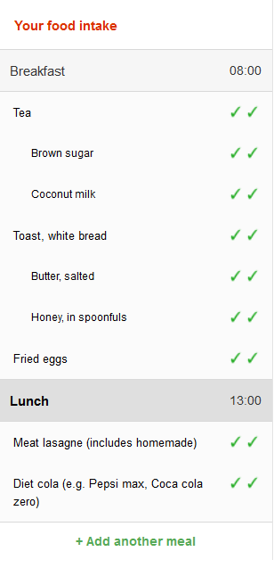
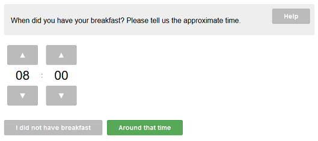

# Version 3 recall model

This page describes the data and user interaction models used for Intake24 version 3.

## Data structure summary

A dietary recall object in Intake24 consists simply of a list of meals, each in turn consisting of a list of foods.

Every object (i.e. recall, meals, foods) has a `flags` field and a `customFields` field that can be used by custom
study schemes to attach additional study-specific data to objects, for instance for meals this could be data like
where the food was consumed (at school, at home etc.) and for foods this could where this specific item was bought.

The recall object has additional standard fields like the recall start time and the submission time, meals have
descriptions and meal times, etc.

::: warning
This section is not intended to provide a detailed description of the version 3 data structures
but to serve as a reference for version 4 developers.
:::

The data structure looks approximately like this:

```json
{
  "startTime": "...",
  "endTime": "...",
  "flags": [...],
  "customData": {...},
  "meals": [
     {
      "name": "Breakfast",
      "time": "18:00",
      "flags": [...],
      "customData": {...},
      "foods": [
         {
           code: "ABCD123",
           searchTerm: "...",
           "flags": [...],
           "customData": {...},
           portionSize: ...,
           ...
         },
         ... // other foods in breakfast
       ]
     },
     ... // other meals
   ]
}
```

## Meal/food list



In version 3 the meal list panel can be found on the left side of the screen. Initially it shows the
standard list of meals suggested by the system (breakfast, lunch etc.) and the meals are empty. Respondents
are free to delete or add more meals as required.

Every meal consists of a list of foods. The green tick marks (see screenshot on the right) represent the completion
state of the food item. First pass (no ticks) is the free text entry which means that the description of the food
item has been entered as an arbitrary text by the responent. Second pass (one tick) means that the free text description
has been matched with a food from the database and the respondent has selected the food that they think best
matches their description.

<div style="clear: both;"></div>

### Linked foods

Some foods in a meal can be marked as linked to some other food, which is called the _main food_. This is mostly
a visual change (linked foods are always grouped under the main food) and does not affect the underlying data structure,
in the sense that the final result is still a flat list of foods.

The linking information is also used by the associated foods system in order to determine what associated foods
have already been entered and don't need to be suggested. For instance, if there is a spread is linked to a toast,
the associated foods system will not suggest any other spreads.

## Selection

The central concept of the recall flow logic is the _current selection_.

The current selection can be one of the following:

- Nothing
- Meal
- Food

Additionally, the system differentiates between _manual selection_ and _automatic selection_.

The current selection type is set to manual when the respondent clicks on a food or a meal. The selection type is
set to automatic when the system has exhausted prompts for the current selection and automatically moves on to the
next item.

Prompt rules (see below) can look at the selection type to determine what prompts are applicable to the current
selection, for instance some prompts will only trigger on manual selection.

### Automatic selection algorithm

The current automatic selection algorithm works as follows:

::: tip
In the below pseudocode **try** means to check whether the food or meal has any active prompts by evaluating
the relevant prompt rules.

If the candidate food or meal has one or more enabled prompts, it becomes the new selection and the
selection is marked as automatic.

Unless stated otherwise the foods are always tried in the order they had been entered, and the meals
are tried in the chronological order.
:::

```
  if current selection is nothing {

    try all foods in all meals starting with the chronologically first meal;

    if none of the foods have prompts available try all meals
  }

  if (current selection is a meal) {

    try foods in the selected meal;

    try foods in the next meal;

    try foods in all other meals, starting from the first;

    if none of the foods have enabled prompts try all meals
  }

  if (current selection is a food) {

    try next food in the same meal;

    if the food is linked to some other food, try that food;

    try all other foods in the same meal starting from the first;

    try the current meal;

    try the meal that follows the current meal;

    try all foods in all meals;

    try all meals;
  }
```

If no further item can be selected, i.e. there are no enabled prompts left for any meal or food, the recall is
marked as complete and the system proceeds to the final questions about the whole recall ("survey prompts").

At this point the respondent can still add meals by clicking on the "Add meal" button or foods by clicking on a
meal in the list.

## Prompts



The main building block of the dietary recall is called a _prompt_. A prompt is usually a simple question about
the currently selected item.

For example, a meal confirmation prompt asks to confirm the time when the respondent had the meal, a ready meal
prompt asks which foods from a meal were ready made etc.

Some prompts are more sophisticated (e.g, portion size estimation prompts) and could consist of several stages,
however in any case the purpose of a prompt is to present a UI to ask a question and add one specific block of
data to the currently selected item (or to the recall as a whole) based on the respondent's answer.

### Prompt types

There are currently four prompt types in the system. The type of a prompt determines what selection type it is
applicable to.

The prompt types are:

#### 1. Food prompts

Applicable to foods regardless of context (i.e. ignoring other foods in the meal). Food prompt UI only has access
to data pertaining to the selected food and can only modify this food. An example of a food prompt is the
portion size estimation.

#### 2. Extended food prompts

Extended food prompts also apply to foods, however they also have access to other foods in the same meal. This
type of prompt is used when the food context matters, such as the associated food prompts. Extended food prompts can
modify the selected food or add or modify foods in the same meal.

#### 3. Meal prompts

Meal prompts apply to meals. They can modify both the data about the meal itself, change the list of foods,
and any data about the foods in the meal.

Examples of meal prompts are the meal confirmation prompt that asks for the time of the meal, the free text food
entry prompt, or the drinks reminder prompt.

#### 4. Survey prompts

Finally, survey prompts are prompts that collect information about the whole recall. This is typically additional
questions such as the context of the submission ("was it a usual day?", "are you following a diet?") or questions
that relate to the whole day ("did you take any dietary supplements?").

<div style="clear: both;"></div>

### Prompt rules

Prompt rules are special functions that are used to determine if a prompt can be shown for the given food or meal.
Typically they inspect the current state of the meal or food, however some rules can also take the overall state
of the recall into consideration. For instance, some prompts are only applicable during the second pass of the
multi-pass model and the current pass is determined by a global survey flag.

::: tip
Prompt rules are associated with the corresponding prompt type UI, which means that a collection of prompt
rules is all that is needed to define and customise the recall flow.
:::

## Main recall loop

When selecting the next prompt from a set of enabled prompts (i.e. the current selection has more than one
enabled prompt) Intake24 v3 uses a prompt priority score, however these priorities are currently equivalent
to the order in which the prompt rules are listed in the code and should be removed.

In version 3 the main recall loop is implemented with a recursive function **showNextPrompt()**:

```
function showNextPrompt() {

  get next prompt for current selection;

  if (next prompt available) {
     show prompt UI;
     when prompt completes, show next prompt;
  } else {
     select next item that has an enabled prompt; // see selection algorithm above

     if (selection available) {
       show next prompt;
     } else {

        get next prompt for survey; // prompts related to the whole recall and not individual
                                       items

        if (next prompt available) {
           show prompt UI;
           when prompt completes, show next prompt;
        } else {
           show submission page;
        }
     }
  }
}

```

## Multiple-pass recall model

Intake24 uses the so-called multiple-pass recall model. The multiple-pass approach simply means that the questions
are grouped into "passes" and the system will not ask any questions associated with subsequent passes until all of
the questions in the previous passes are exhausted.

In other words the system will initially go over all of the meals and foods and ask questions from the first pass only,
and when no more questions remain it will go back to the first meal and start asking question from the second pass.

This model is somewhat complicated by the ability of the respondent to freely add or delete meals and foods at any point
during the recall. Although the first pass could have been finished prompts from this pass still have to be shown
for the new entries.

In Intake24 v3 this logic is implemented using global recall flags in combination with prompt rule logic. For instance,
when the first pass prompts have been exhausted the system will mark the recall with a special flag that will unlock
the second pass prompts, however if a new food is added the first pass prompts will still be shown for that food.

This interaction can sometimes lead to complicated interaction between prompts and the selection order.
