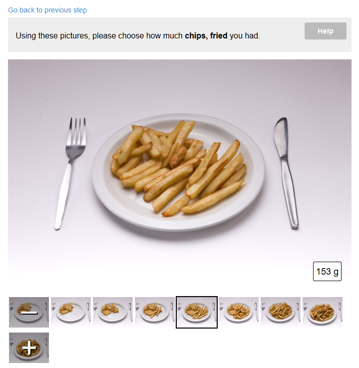

# Portion size methods

This page describes the portion size estimation methods used in Intake24 with respect to user interaction. See [the API
documentation](../api/respondent/food-data.html) for the related API functions and data structure description.

## Portion size estimation option selection

This screen is the first step of the portion size estimation process.

If there is more than one way to estimate the portion size defined for the food the system will ask the respondent to
choose the option they would like to use.

Each option has an associated small image and a text description. The description text is localised and displayed
in the respondent's local language. Portion size estimation options don't necessarily have to use different methods
(i.e. they could be several `as served` options using different sets of images).  

The number of options that can be associated with a food is technically unlimited, but in practice is typically 
between 2 and 5.

If there is only one portion size estimation option associated with a food, this screen is not shown.

See also the [get food data](../api/respondent/food-data.html#get-food-data) API function and the
[v3 implementation](https://github.com/MRC-Epid-it24/survey-frontend/blob/master/SurveyClient/src/main/java/uk/ac/ncl/openlab/intake24/client/survey/prompts/ChoosePortionSizeMethodPrompt.java).

## As served

The "as served" portion size estimation method uses a sequence of images of food served on a plate. The weight of 
food shown in each image is carefully measured when the pictures are taken and is stored in the database.

Usually there are seven images covering 95% of the typical portion sizes, however this number is not fixed and some
foods use fewer or more images.

The user is asked to select the image that looks most like the amount of food they were served. The images can be 
selected either using the `I had less` and `I had more buttons` or by clicking on a thumbnail.

There are special options to indicate that the amount of food consumed was less than in the smallest or more
than in the larges portion in the available images. These options can be accessed either by clicking the `I had less`
or `I had more` button while having the smallest and the largest potion size image selected respectively or by
clicking on the special `-` or `+` thumbnails.

If this option is selected, the respondent is asked to choose the fraction of the smallest porion or the multiple of
the largest portion. The fraction selection is currently implemented using arrow buttons that allow to adjust the
fraction in 1/4 increments. The resulting portion weight is also displayed for reference.

The "as served" method can optionally include a second set of images representing the leftovers. If leftovers function
is enabled, the respondent is asked to indicate how much food they had left using the same UI and the resulting
portion size is calculated as `(serving weight) - (leftovers weight)`.

See also [get as served data](http://localhost:8300/api/respondent/food-data.html#get-as-served-image-set-data) API function
and [v3 implementation](https://github.com/MRC-Epid-it24/survey-frontend/blob/master/SurveyClient/src/main/java/uk/ac/ncl/openlab/intake24/client/survey/prompts/simple/AsServedPrompt2.java)   

## Guide image

The "guide image" portion size estimation method uses a single image showing several distinct objects. The respondent 
is asked to select the object that most closely matches the food they had.  This could be used to determine, 
for example, the size of a fruit, or the shape and volume of a tin. 

Objects can be selected by either clicking/tapping them directly in the image or by using the arrow keys on the keyboard.

Each object in the image is defined in terms of its outline (represented as coordinates of points of a polyline),
description and weight.

In the current implementation each outline is a separate transparent overlay image generated on the server when changes
are made to the list of objects in the guide image. This technique was used for compatibility purposes with older 
browsers but it is no longer relevant and should be replaces with a canvas or SVG based approach instead.  

Having selected an object the respondent is then asked to enter how many items like that they had.

 
 The quantity input UI currently has two separate counters for whole and fractional parts. This screen has been 
 identified as one of the more confusing ones and needs a redesign.   

See also [get as served data](http://localhost:8300/api/respondent/food-data.html#get-guide-image-data) API function 
and [v3 implementation](https://github.com/MRC-Epid-it24/survey-frontend/blob/master/SurveyClient/src/main/java/uk/ac/ncl/openlab/intake24/client/survey/prompts/simple/GuidePrompt.java). 

## Drink scale

## Standard portion

## Cereal

## Pizza

## Portion
