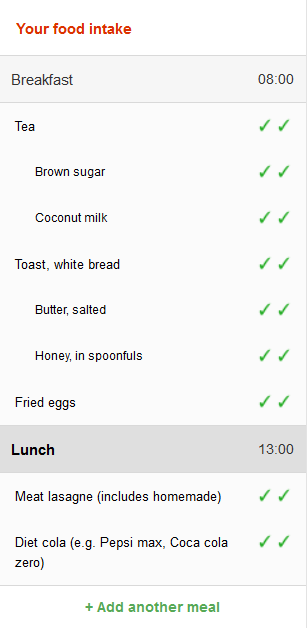

# Version 3 recall model

This page describes the data and user interaction models used for Intake24 version 3. 

## Data structure summary

A dietary recall object in Intake24 consists simply of a list of meals, each in turn consisting of a list of foods.

Every object (i.e. recall, meals, foods) has a `flags` field and a `customFields` field that can be used by custom
study schemes to attach additional study-specific data to objects, for instance for meals this could be data like 
where the food was consumed (at school, at home etc.) and for foods this could where this specific item was bought.

The recall object has additional standard fields like the recall start time and the submission time, meals have
descriptions and meal times, etc.

::: warning
This section is not intended to provide a detailed description of the version 3 data structures
but to serve as a reference for version 4 developers.  
:::

The data structure looks approximately like this: 

``` json
{
  "startTime": "...",
  "endTime": "...",
  "flags": [...],
  "customData": {...},
  "meals": [
     {
      "name": "Breakfast",
      "time": "18:00",
      "flags": [...],
      "customData": {...},
      "foods": [
         {
           code: "ABCD123", 
           searchTerm: "...",
           "flags": [...],
           "customData": {...},
           portionSize: ...,
           ...       
         },
         ... // other foods in breakfast
       ]
     },
     ... // other meals
   ]
}
```

## Meal/food list



In version 3 the meal list panel can be found on the left side of the screen. Initially it shows the 
standard list of meals suggested by the system (breakfast, lunch etc.) and the meals are empty. Respondents
are free to delete or add more meals as required.

Every meal consists of a list of foods. The green tick marks (see screenshot on the right) represent the completion 
state of the food item. Stage one (no ticks) is the free text entry which means that the description of the food 
item has been entered as an arbitrary text by the responent. Stage two (one tick) means that the free text description
has been matched with a food from the database and the respondent has selected the food that they think best
matches their description.

<div style="clear: both;"></div>

### Linked foods

Some foods in a meal can be marked as **linked** to some other food, which is called the **main food**. This is mostly 
a visual change (linked foods are always grouped under the main food) and does not affect the underlying data structure,
in the sense that the final result is a flat list of foods.

The linking information is also used by the associated foods system in order to determine what associated foods
have already been entered and don't need to be suggested. For instance, if some spread is linked to toast, the
associated foods system will not suggest any other spreads.  

## Selection

The central concept of the recall flow logic is the **current selection**.

The current selection can be one of the following:

- Nothing
- Meal
- Food

Additionally, the system differentiates between **manual selection** and **automatic selection**.  

The current selection type is set to manual when the respondent clicks on a food or a meal. The selection type is 
set to automatic when the system has exhausted prompts for the current selection and automatically moves to the 
next item.  

Prompt rules (see below) can look at the selection type to determine what prompts are applicable to the current
selection, for instance some prompts will only trigger on manual selection. 

### Automatic selection algorithm

The current automatic selection algorithm works as follows:

::: tip
In the below pseudocode **try** means to check whether the food or meal has any active prompts by evaluating
the relevant prompt rules.

If the candidate food or meal does have one or more enabled prompts, it becomes the new selection and the
selection is marked as automatic.

Unless stated otherwise the foods are always tried in the order they had been entered, and the meals
are tried in the chronological order. 
:::


```
  if current selection is nothing {

    try all foods in all meals starting with the chronologically first meal;

    if none of the foods have prompts available try all meals
  }

  if (current selection is a meal) {

    try foods in the selected meal;

    try foods in the next meal;

    try foods in all other meals, starting from the first;

    if none of the foods have prompts available try all meals
  }

  if (current selection is a food) {

    try next food in the same meal;

    if the food is linked to some other food, try that food;

    try all other foods in the same meal starting from the first;

    try the current meal;

    try the meal that follows the current meal;

    try all foods in all meals;

    try all meals;     
  }
```

If no further item can be selected, i.e. there are no enabled prompts left for any meal or food, the recall is
marked as complete and the system proceeds to the final questions about the whole recall ("survey prompts").  

## Prompts 

TODO

- Prompts are typically simple questions

- Prompt types
  - Food prompts
  - Extended food prompts
  - Meal prompts
  - Survey prompts


### Prompt rules

TODO

Function of current state of the item, selection type and survey flags to boolean.

## Main recall loop

::: tip
When selecting the next prompt from a set of enabled prompts (i.e. the current selection has more than one
enabled prompt) Intake24 v3 uses a prompt priority score, however these priorities are currently equivalent
to the order in which the prompt rules are listed in the code and should be removed.
:::

In version 3 the main recall loop is implemented with a recursive function **showNextPrompt()**:

```
function showNextPrompt() {

  get next prompt for current selection;

  if (next prompt available) {
     show prompt UI;
     when prompt completes, show next prompt;
  } else {
     select next item that has an enabled prompt; // see selection algorithm above
     
     if (selection available) {
       show next prompt;
     } else {

        get next prompt for survey; // prompts related to the whole recall and not individual
                                       items

        if (next prompt available) {
           show prompt UI;
           when prompt completes, show next prompt;
        } else {
           show submission page;
        }
     }
  }
}

```

## Multiple-pass

TODO
 
Update flags, e.g. when all times confirmed
